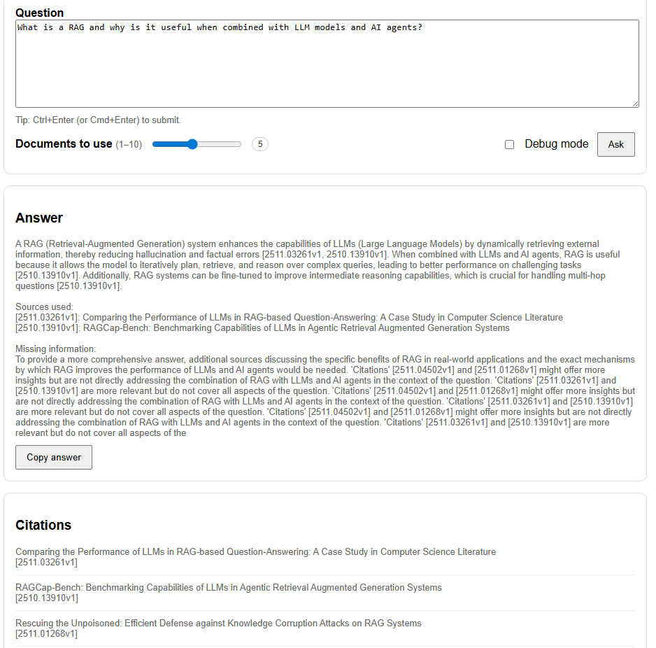

# Research Assistant – Retrieval-Augmented Generation (RAG)

## Skills Practiced

- Retrieval-Augmented Generation (RAG) system design
- Vector databases and similarity search (LanceDB)
- Sentence-transformer embeddings
- Cross-encoder reranking for retrieval quality
- Local LLM inference with llama.cpp (GGUF models)
- FastAPI backend development
- Frontend-backend interaction (REST API + UI)
- Docker and Docker Compose for reproducibility
- Configuration-driven ML systems
- Citation grounding and answer validation
- End-to-end ML system engineering

---

## Project Description

This project implements a local Retrieval-Augmented Generation (RAG) research assistant for querying academic literature.

The system collects academic paper abstracts (e.g., from arXiv), builds a vector index over the documents, retrieves the most relevant papers for a given query, and generates grounded answers using a local Large Language Model (LLM). All answers are accompanied by explicit citations to the retrieved sources.

The project is designed to be:
- Fully local / offline (no external LLM APIs required)
- Reproducible (Dockerized)
- Modular and extensible
- Suitable as a foundation for agent-based or evaluation-driven RAG systems

---

## How to Run the Project

### 1. Collect Data

The first step is to collect academic abstracts based on the configuration defined in config.yml.

The configuration specifies:
- Data source (e.g., arXiv)
- Academic categories and sampling weights
- Time range and maximum number of papers
- Output path for the raw dataset

Run the data collection script:

    python scripts/collect_data.py

This will create a JSONL file containing paper abstracts, typically stored at:

    data/raw/abstracts.jsonl

---

### 2. Build the Vector Index

Once the raw data has been collected, build the vector index using sentence embeddings and LanceDB.

This step:
- Embeds each abstract using a sentence-transformer model
- Stores embeddings and metadata in a LanceDB table
- Enables efficient similarity-based retrieval
- Optionally supports cross-encoder reranking at query time

Run the indexing script:

    python scripts/build_index.py

After completion, the vector index will be stored under:

    data/index/lancedb/

---

### 3. Build the Docker Image and Run the Container

The application is designed to run inside Docker for full reproducibility.

From the project root directory, build the image and start the container:

    docker compose up --build

This will:
- Build the Docker image
- Mount the local model and data directories
- Start the FastAPI server on port 8080

Once running, the application is available at:

    http://localhost:8080/

---

## Application Usage

### Web Interface

The root endpoint (/) serves a simple web UI that allows users to:
- Enter natural-language questions
- Control the number of retrieved documents
- Enable debug mode
- View generated answers with citations
- Inspect retrieved context and intermediate results

This interface communicates directly with the backend API.

---

### API

The main API endpoint is:

    POST /answer

Example request body:

    {
      "query": "What is Retrieval-Augmented Generation and why is it useful?",
      "top_k": 5,
      "debug": false
    }

The response includes:
- Generated answer
- List of cited papers
- Retrieved context
- Optional debug information

---

## Notes

- The LLM runs locally using llama.cpp with a GGUF model file mounted at runtime.
- The vector index and datasets are persisted on the host machine and reused across runs.
- The system is intentionally modular to allow easy extension with:
  - Agent-based reasoning
  - Fallback models
  - Evaluation pipelines
  - Confidence and coverage estimation

---
